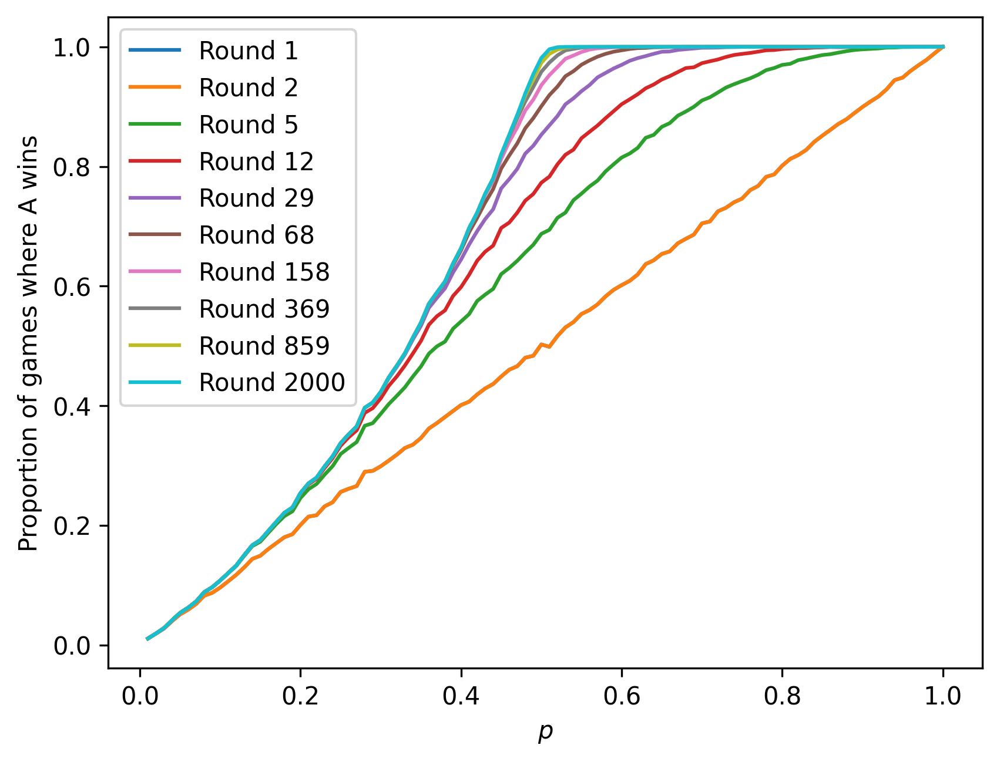

# Rounds Problem

A game has two players. The game is played in rounds, in each round the winner gets a point, player A has a probability $p$ of winning each round. Player A can choose when to stop the game. Player A wins the game if they have more points than player B.

## Monte Carlo Approach

The optimal strategy for player A is to not to stop the game until they are ahead. So we are interested in the probability of winning as the numbers of rounds $\rightarrow \infty$.

Simulating this for 20000 games and plotting the proportion of which A has won as a function of $p$, after increasing numbers of rounds:

